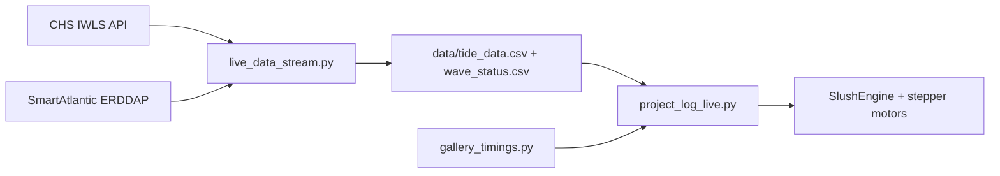

# Driftwood

Kinetic installation software for a Raspberry Pi that drives stepper motors in response to live tide and wave data from Newfoundland.

[](LICENSE)

Deploy the repo to `/home/pi/driftwood` on the Pi.

## Documentation

| Doc | Purpose |
|-----|---------|
| [CONTRIBUTING.md](CONTRIBUTING.md) | How to set up, develop, and submit changes |
| [SECURITY.md](SECURITY.md) | Reporting vulnerabilities and what not to commit |
| [CHANGELOG.md](CHANGELOG.md) | Notable project changes |
| [viz/README.md](viz/README.md) | Optional browser visualization |

## Install

From the Pi (clones from GitHub):

```bash
curl -fsSL https://raw.githubusercontent.com/adamsimms/driftwood/master/deploy/install.sh | bash
```

Or from a local checkout:

```bash
./deploy/install.sh --from-source
```

The installer renames `~/logberry` to `~/driftwood` if needed, moves any legacy CSVs from `scripts/` to `data/`, and installs Python dependencies.

**Requirements:** Python 3.10+, Raspberry Pi OS (or similar Linux) on the Pi. Tested with Raspberry Pi 3 Model B.

## Architecture



- **`scripts/live_data_stream.py`** — polls external APIs and writes CSV files to `data/`
- **`scripts/project_log_live.py`** — thin entry point; motor logic lives in `motor_*.py`
- **`scripts/check_apis.py`** — verify tide and wave data sources
- **`scripts/play_test.py`** — manual motor positioning for calibration
- **`viz/`** — optional WebGL ocean simulation (browser only, not used by the Pi)

### Data sources

| Data | Source | Default |
|------|--------|---------|
| Tide | [CHS Integrated Water Level System (IWLS)](https://api-iwls.dfo-mpo.gc.ca) | Bonavista (station 00990) |
| Waves | [SmartAtlantic ERDDAP](https://www.smartatlantic.ca/erddap/index.html) | Holyrood Buoy 2 |

> **Note:** The original Mouth of Placentia Bay buoy dataset was decommissioned in 2022. The default wave source is the nearest active SmartAtlantic buoy (Holyrood Buoy 2). Change `WAVE_ERDDAP_DATASET` in `config/data_input.py` to use a different dataset.

## Quick start

Install the [SlushEngine Python library](https://github.com/Roboteurs/slushengine) separately — it requires the motor driver hardware.

If you have not run the [install step](#install) yet, do that first.

Verify data sources:

```bash
cd ~/driftwood/scripts && python3 check_apis.py
```

Start live tide and wave data:

```bash
cd ~/driftwood/scripts && python3 live_data_stream.py
```

Start motors:

```bash
cd ~/driftwood/scripts && python3 project_log_live.py
```

Configure log position manually in cm (e.g. `-10,15`):

```bash
cd ~/driftwood/scripts && python3 play_test.py
```

See what Python processes are running:

```bash
ps -ef | grep python
```

## Configuration

Edit `config/data_input.py` on the Pi:

| Parameter | Description |
|-----------|-------------|
| `lowest_tide` | Motor steps from home to lowest tide position |
| `tide_range` | Motor steps between lowest and highest tide |
| `multiplier` | Scales wave motion amplitude |
| `speed_multiplier` | Scales motor speed (max ~2) |
| `data_refresh_interval` | Seconds between API polls in the data stream |
| `TIDE_STATION_ID` | CHS IWLS station ID (default: Bonavista) |
| `WAVE_ERDDAP_DATASET` | SmartAtlantic ERDDAP dataset (default: Holyrood Buoy 2) |

Gallery hours are defined in `config/gallery_hours.py`. Update `GALLERY_HOURS` for your venue schedule (weekday keys: Monday=0 … Sunday=6).

## Auto-start on boot (systemd)

Copy the unit files and enable them:

```bash
sudo cp deploy/systemd/driftwood-data.service /etc/systemd/system/
sudo cp deploy/systemd/driftwood-motors.service /etc/systemd/system/
sudo systemctl daemon-reload
sudo systemctl enable driftwood-data driftwood-motors
sudo systemctl start driftwood-data driftwood-motors
```

Check status:

```bash
sudo systemctl status driftwood-data driftwood-motors
```

## Troubleshooting

| Problem | Things to try |
|---------|----------------|
| `check_apis.py` tide fails | Confirm network access; verify `TIDE_STATION_ID` in `config/data_input.py`; check [IWLS API status](https://api-iwls.dfo-mpo.gc.ca) |
| `check_apis.py` wave fails | The ERDDAP dataset may be offline or decommissioned — try another dataset from [SmartAtlantic ERDDAP](https://www.smartatlantic.ca/erddap/index.html) and update `WAVE_ERDDAP_DATASET` |
| Empty or missing CSVs in `data/` | Run `live_data_stream.py` and wait for a successful fetch; check `check_apis.py` first |
| Motors do not move | Confirm SlushEngine is installed; run `play_test.py` for manual calibration; check motor power and wiring |
| `ModuleNotFoundError: Slush` | Install the [SlushEngine Python library](https://github.com/Roboteurs/slushengine) on the Pi |
| Gallery closed message | Update `config/gallery_hours.py` for your schedule |
| Permission errors on Pi | Ensure scripts run as the `pi` user; systemd units assume `/home/pi/driftwood` |

## Scheduled reboot (optional)

Schedule a cron task via `crontab -e`:

```
45 11 * * * sudo reboot
```

## Wi-Fi setup

Configure network access on the Pi through your OS network manager (e.g. NetworkManager for eduroam). Do not commit credentials or machine-specific network config to this repo. See [SECURITY.md](SECURITY.md).

## Hardware

- [Raspberry Pi 3 Model B](https://www.raspberrypi.org/products/raspberry-pi-3-model-b/)
- [Raspberry Pi Power Supply 5V 3A](https://www.robotshop.com/ca/en/raspberry-pi-power-supply-5v-3a-micro-usb.html) *(optional)*
- [SlushEngine](https://roboteurs.com/products/slushengine)
- [Nema 23 Stepper Motor](https://www.amazon.ca/Stepper-Motor-Bipolar-340oz-Router/dp/B074X52ZR2/ref=sr_1_1?s=industrial&ie=UTF8&qid=1521390147&sr=8-1&keywords=340oz.in+1.8A+4.95V) — Bipolar 340oz.in 1.8A 4.95V 4 Wires CNC Router
- [2.1mm Barrel Jack to terminal](https://www.robotshop.com/ca/en/barrel-jack-terminal-fit0151.html)
- [8mm Aluminum Key Hub w/ Set Screw](https://www.robotshop.com/ca/en/8mm-aluminum-key-hub-set-screw.html)
- [12VDC 3A Wall Adapter Power Supply](https://www.robotshop.com/ca/en/12vdc-3a-wall-adapter-power-supply.html)
- Heat sinks
